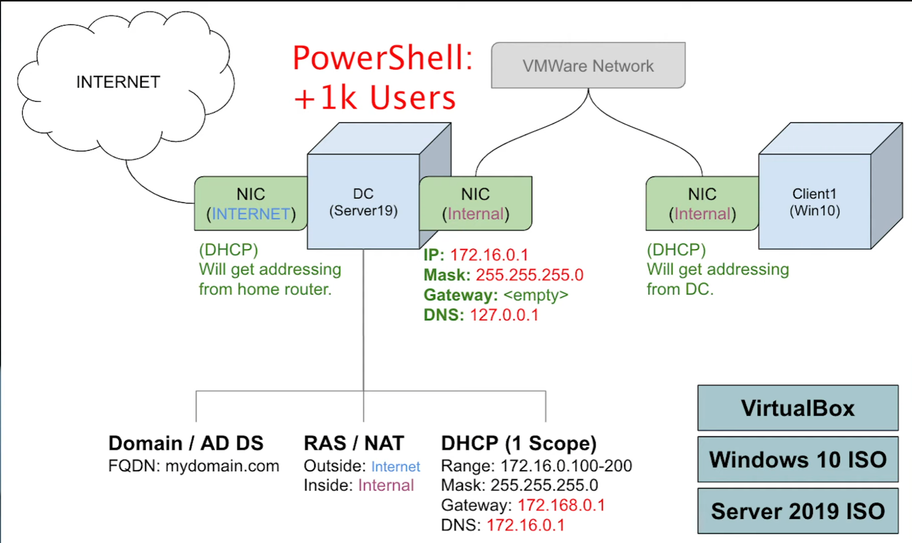

# Setting Up a Basic Active Directory Home Lab with Oracle VirtualBox 💻

This walkthrough guides you through setting up a basic Active Directory home lab using Oracle VirtualBox. This lab environment allows you to learn and experiment with Active Directory, a crucial component of Windows Server environments. 🧪

## 1. Introduction & Overview 💡

Active Directory (AD) is a directory service developed by Microsoft that stores information about objects on a network and makes this information easily accessible to users and administrators. 🧑‍💻 Setting up a home lab provides a safe environment to learn AD administration without affecting a production network. 🛡️ This walkthrough covers the essential steps to create a simple AD environment with a Domain Controller and a Client Machine.

The basic network setup will consist of two virtual machines:

*   **Domain Controller (Server 2019):** This machine will host the Active Directory Domain Services. 🖥️
*   **Client Machine (Windows 10):** This machine will be joined to the domain. 🗄️

## 2. Setting Up the Virtual Environment ⚙️

### 2.1 Install VirtualBox

1.  Download Oracle VirtualBox from the official website: [https://www.virtualbox.org/](https://www.virtualbox.org/) 🌐
2.  Install VirtualBox following the on-screen instructions.

### 2.2 Download ISOs

Download the ISO files for:

*   Windows Server 2019 (Evaluation copy is sufficient for learning) 💾
*   Windows 10 (You can use a Windows 10 trial or a retail copy) 💿

### 2.3 Create Virtual Machines

#### 2.3.1 Domain Controller (Server 2019)

1.  Open VirtualBox and click "New." ➕
2.  Name the VM (e.g., "DC01"). Select Microsoft Windows and the appropriate Server 2019 version.
3.  Allocate sufficient RAM (e.g., 4GB or more). 🐏
4.  Create a virtual hard disk (VHD) with sufficient storage (e.g., 50GB or more). 💽
5.  In the VM settings, go to "Storage" and add the Server 2019 ISO file to the virtual DVD drive. 📀
6.  Go to "Network" and select "Bridged Adapter" or create a "Host-only" network if you prefer isolated network. 🔗

#### 2.3.2 Client Machine (Windows 10)

Repeat the above steps to create a VM for the Client Machine, but select Windows 10 as the operating system and allocate appropriate resources.

### 2.4 Configure Virtual Machines

*   **Processor & Memory:** Adjust the number of processor cores and RAM according to your system resources. ⚙️
*   **Network:** Ensure both VMs are on the same network (either bridged or host-only if you created one). 🌐

## 3. Install Operating Systems 💽

Boot each VM from their respective ISO files and follow the on-screen instructions to install Server 2019 on the Domain Controller VM and Windows 10 on the Client Machine VM.

## 4. Configure Domain Controller 👑

### 4.1 Promote to Domain Controller

1.  After installing Server 2019, open Server Manager.
2.  Add the "Active Directory Domain Services" role.
3.  Promote the server to a domain controller.
4.  Create a new domain (e.g., "mydomain.local"). Choose a strong password for the Directory Services Restore Mode (DSRM). 🔑

### 4.2 Create a Domain

Follow the prompts to create the Active Directory domain. This process will install DNS and other necessary components. ➕

## 5. Create User Accounts 👤

Use PowerShell to create user accounts within the domain. (Provide example PowerShell commands in the repository).

## 6. Join Client Machine to Domain 🤝

1.  On the Windows 10 VM, go to System Properties.
2.  Change the computer's domain to the domain you created (e.g., "mydomain.local").
3.  Provide the credentials of a domain administrator account.

## 7. Test Domain Join ✅

1.  Log in to the Windows 10 VM using a domain user account.
2.  Verify domain membership by checking the system properties or using command-line tools (e.g., `whoami`).

## 8. Conclusion 🎉

You have now successfully set up a basic Active Directory home lab. This environment allows you to practice various Active Directory administration tasks. Explore further by implementing Group Policy, DNS, DHCP, and other services to expand your knowledge. 🚀

---
